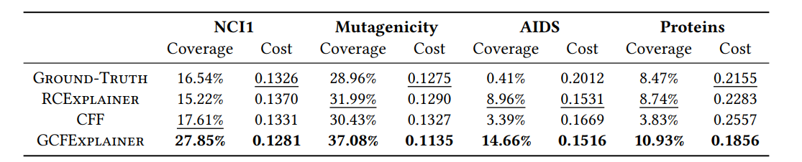

# Global Counterfactual Explainer for Graph Neural Networks

This repository is a reference implementation of the global graph counterfactual explainer as described in the paper:
<br/>
> Global Counterfactual Explainer for Graph Neural Networks.<br>
> Mert Kosan*, Zexi Huang*, Sourav Medya, Sayan Ranu, Ambuj Singh.<br>
> ACM International Conference on Web Search and Data Mining, 2023.<br>
> https://dl.acm.org/doi/10.1145/3539597.3570376

The link contains the manuscript and the presentation video in supplement.

## Requirements

The easiest way to install the dependencies is via [conda](https://conda.io/projects/conda/en/latest/user-guide/install/index.html). Once you have conda installed, run this command:

```setup
conda env create -f environment.yml
```

If you want to install dependencies manually, we tested our code in Python 3.8.0 using the following main dependencies:

- [PyTorch](https://pytorch.org/get-started/locally/) v1.8.0
- [PyTorch Geometric](https://pytorch-geometric.readthedocs.io/en/latest/notes/installation.html) v1.7.2
- [NetworkX](https://networkx.org/documentation/networkx-2.5/install.html) v3.0
- [NumPY](https://numpy.org/install/) v1.23.5
- [tqdm](https://tqdm.github.io/) v4.65.0

All our experiments are run on a machine with 2 NVIDIA GeForce RTX 2080 GPU (8GB of RAM) and 32 Intel Xeon CPUs (2.10GHz and 128GB of RAM).

## Generating Counterfactual Candidates

To generate counterfactual candidates for AIDS dataset with the default hyperparameters, run this command:

```train
python vrrw.py --dataset aids
```

The counterfactual candidates and meta information is saved under `results/{dataset}/runs/`. You can check other available training options with:

```train_option
python vrrw.py --help
```

## Generating Summary Counterfactuals

To generate counterfactual summary set for AIDS dataset from the candidates with the default hyperparameters, run this command:

```summary
python summary.py --dataset aids
```

The coverage and cost performance under different number of summary size will be printed on screen. You can check other available summary options with:

```summary_option
python summary.py --help
```

## Coverage and Cost Performance

Table shows Recourse coverage (𝜃 = 0.1) and median recourse cost comparison between GCFExplainer and baselines for a 10-graph global explanation. 
GCFExplainer consistently and significantly outperforms all baselines across different datasets.



## Case Study on AIDS dataset

Figure illustrates global and local counterfactual explanations for the AIDS dataset. The global counterfactual graph (c) presents a high-level recourse rule—changing ketones and ethers into 
aldehydes (shown in blue)—to combat HIV, while the edge removals (shown in red) recommended by local counterfactual examples (b) are hard to generalize.

<p align="center" width="100%">
    
</p>

## Citing
If you find our framework useful, please consider citing the following paper:

	@inproceedings{gcfexplainer2023,
	author = {Kosan, Mert and Huang, Zexi and Medya, Sourav and Ranu, Sayan and Singh, Ambuj},
	 title = {Global Counterfactual Explainer for Graph Neural Networks},
	 booktitle = {WSDM},
	 year = {2023}
	}

